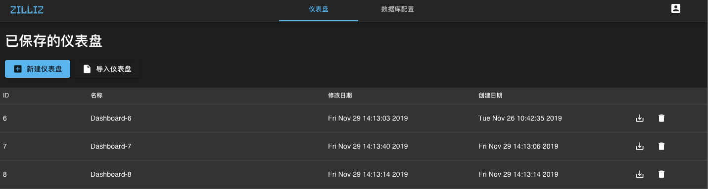
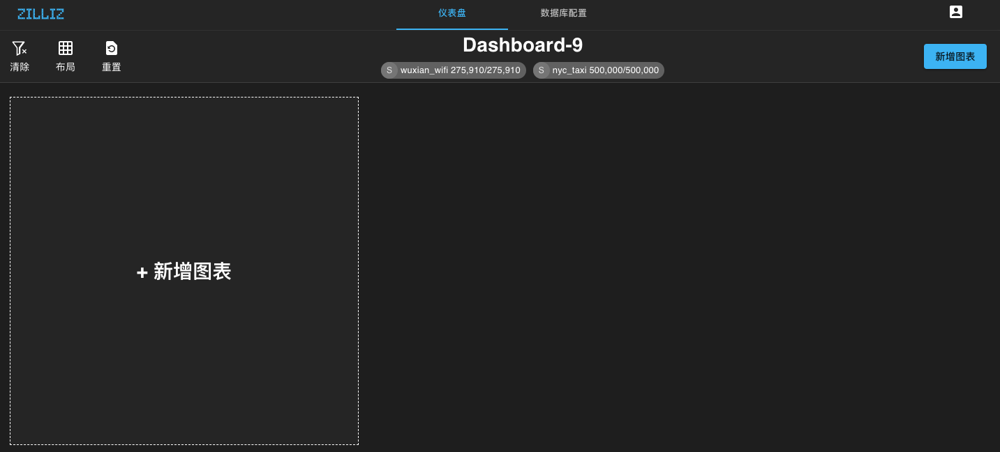
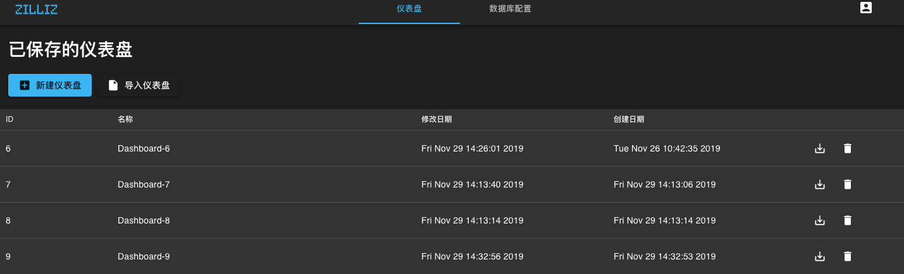

# 添加仪表盘和图表

1. 在 Infini 界面的仪表盘选项卡上点击 **新建仪表盘** 按钮来添加新的仪表盘。

    

    已添加的仪表盘如下图所示：

    

2. 点击 **仪表盘** 按钮，你可以看到刚刚新建的仪表盘已经被添加到列表中。

    

## 添加图表

1. 点击 **新增图表**。

    

2. 在图表编辑界面中可选择图表类型并设置参数。

    

3. 图表设置完成后，点击 **应用** 即可将图表保存到仪表盘。
