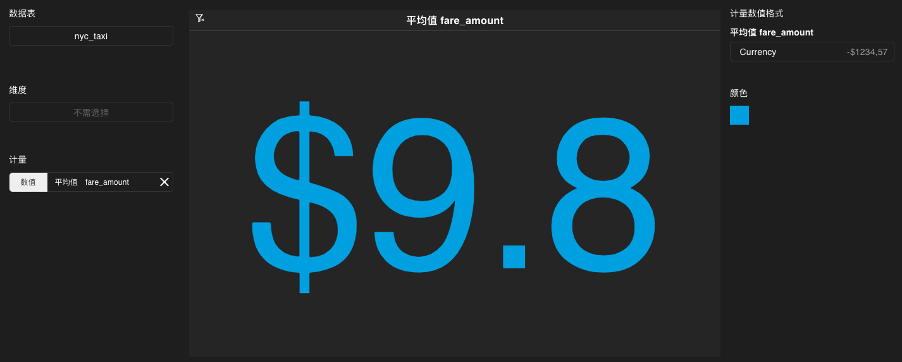
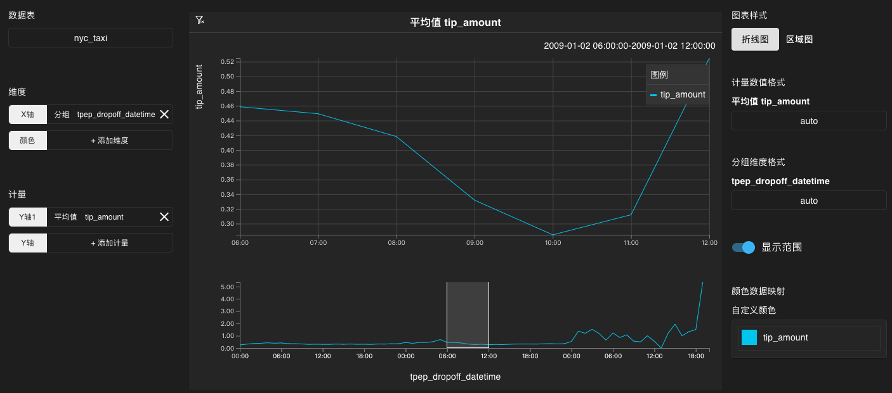
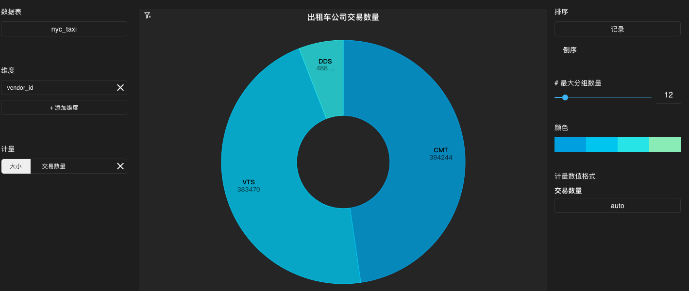
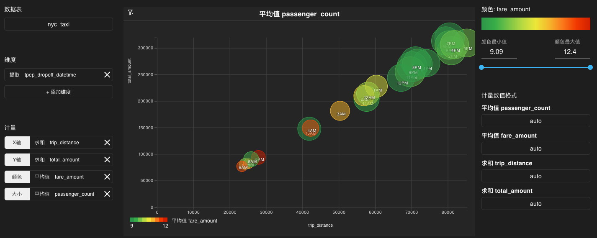

# 图表类型及参数说明

<!-- TOC -->

- [数图](#数图)
- [折线图](#折线图)
- [饼图](#饼图)
- [条形图](#条形图)
- [堆垛图](#堆垛图)
- [表格](#表格)
- [热力图](#热力图)
- [散点图](#散点图)
- [气泡图](#气泡图)
- [点地图](#点地图)
- [热力地图](#热力地图)

<!-- /TOC -->

## 数图

### 简介

在数图中，您可以通过各种计量方式和格式来显示数值。下图显示了出租车小费的平均值。

### 参数说明

数图的参数如下表所示：

| 参数 | 说明 |
|------|--------------|
|`数据表`  |   数据库中的表名。作为图表的数据源。此参数为必选参数。   |
|`维度`   |   数图无需选择维度字段。   |
|`计量`    |   图表所需的计量字段。表示如何对数据进行计算。包括以下参数：<ul><li>`数值`：数图中显示的数值。此参数为必选参数。</li></ul>支持自定义使用 SQL 计量。关于支持的 SQL 函数请参考 [函数和操作符](./megawise_func_op)。              |
|`计量数值格式` |  计量数据在图表中的显示格式。|
|`颜色`    |    数字颜色。            |

### 设置过滤条件

数图无法设置过滤条件。

## 折线图

### 简介

在折线图中，您可以分析数据在某个范围内的变化轨迹，同时也可以对多种数据进行相关性分析。下图显示了出租车小费平均值在不同时刻的变化轨迹。

### 参数说明

折线图的参数如下表所示：

| 参数 | 说明 |
|------|--------------|
|`数据表`  |   数据库中的表名。作为图表的数据源。此参数为必选参数。    |
|`维度`    |   图表所需的维度字段。表示如何对数据进行分组。包括以下参数：<ul><li>`X轴`：折线图 X 轴的数据。此参数为必选参数。</li><li>`颜色`：表示如何对折线的颜色进行分组。</li></ul> 支持使用表中的列名作为参数值或自定义使用 SQL 对数据进行分组。关于支持的 SQL 语法请参考 [基本数据操作](./megawise_basic_operation)。   |
|`计量`    |   图表所需的计量字段。表示如何对数据进行计算。包括以下参数：<ul><li>Y轴：折线图 Y 轴的数据。此参数为必选参数。您可以添加多条折线。如果您为`颜色`参数赋值，则无法选择多个 Y 轴参数。</li></ul>  支持使用自带的计量函数或自定义使用 SQL 计量。关于支持的 SQL 函数请参考 [函数和操作符](./megawise_func_op)。           |
|`图表样式` |   可选择折线图或区域图。区域图的效果如下图所示：    |
|`计量数值格式` |  计量数据在图表中的显示格式。|
|`分组维度格式` |  维度数据在图表中的显示格式。|
|`显示范围`     | 开启时，图表底部显示折线图的整体，使用鼠标拖拽任意一个区域就可以使上方图表放大显示该区域。      |
|`颜色数据映射`   |    自定义折线颜色。          |

### 设置过滤条件

在折线图中用鼠标拖拽选择任意矩形区域即可建立过滤条件。点击折线图左上方的删除过滤条件按钮即可删除过滤条件。

用鼠标拖拽任意选取一个矩形区域，点击三角形的播放按钮，即可实现折线图自动播放。自动播放等价于一个移动的过滤条件，可以使仪表盘上的其他相关图表产生实时变化。

  

## 饼图

### 简介

在饼图中，您可以分析整体中不同部分所占的比例。下图显示了不同出租车公司的交易数量所占总交易数量的比例。

### 参数说明

饼图的参数如下表所示：

| 参数 | 说明 |
|------|--------------|
|`数据表`  |   数据库中的表名。作为图表的数据源。此参数为必选参数。   |
|`维度`    |   图表所需的维度字段。表示如何对数据进行分组。支持使用表中的列名作为参数值或自定义使用 SQL 对数据进行分组。关于支持的 SQL 语法请参考 [基本数据操作](./megawise_basic_operation)。此参数为必选参数。    |
|`计量`    |   图表所需的计量字段。表示如何对数据进行计算。包括以下参数：<ul><li>大小：用于表示饼图中扇形的大小。此参数为必选参数。</li></ul>     支持使用自带的计量函数或自定义使用 SQL 计量。关于支持的 SQL 函数请参考 [函数和操作符](./megawise_func_op)。          |
|`排序`    |        数据库表的列名及顺序。作为图表的排序依据。  |  
|`最大分组数量`     |   饼图上能容纳的最大分组数量。    |
|`颜色`      |   饼图的颜色范围。      |
|`计量数值格式` |  计量数据在图表中的显示格式。|

### 设置过滤条件

点击饼图上的任意一个扇形，如果此扇形变亮，则说明此扇形代表的数据已加入过滤条件。

## 条形图

### 简介

在条形图中，您可以在不同条件下对特定种类的数据进行分析。下图显示了不同时刻出租车乘客数量的平均值。

### 参数说明

| 参数 | 说明 |
|------|--------------|
|`数据表`  |   数据库中的表名。作为图表的数据源。此参数为必选参数。   |
|`维度`    |   图表所需的维度字段。表示如何对数据进行分组。支持使用表中的列名作为参数值或自定义使用 SQL 对数据进行分组。关于支持的 SQL 语法请参考 [基本数据操作](./megawise_basic_operation)。此参数为必选参数。     |
|`计量`    |   图表所需的计量字段。表示如何对数据进行计算。包括以下参数：<ul><li>数值：表示条形图中条形的长度。此参数为必选参数。</li><li>颜色：表示条形图中条形的颜色。</li></ul>   支持使用自带的计量函数或自定义使用 SQL 计量。关于支持的 SQL 函数请参考 [函数和操作符](./megawise_func_op)。          |
|`排序`    |        数据库表的列名及顺序。作为图表的排序依据。  |  
|`最大分组数量`     |   条形图上能容纳的最大分组数量。    |
|`颜色`    |      条形图的颜色范围。          |
|`计量数值格式` |  计量数据在图表中的显示格式。|

### 设置过滤条件

点击条形图上的任意一个条形，如果此条形变亮，则说明此条形代表的数据已加入过滤条件。

## 堆垛图

### 简介

在堆垛图中，您可以将多种数据的条形堆叠起来，从而分析各个类别的数据与其子类的关系。下图显示了每个 WiFi 网络类型下包含的各种 SSID 子类。

### 参数说明

堆垛图的参数如下表所示：

| 参数 | 说明 |
|------|--------------|
|`数据表`  |   数据库中的表名。作为图表的数据源。此参数为必选参数。   |
|`维度`   |   图表所需的维度字段。表示如何对数据进行分组。包括以下参数：<ul><li>X轴：表示堆垛图中条形的分组。此参数为必选参数。</li><li>颜色：表示堆垛图中每个条形颜色的分组。</li></ul> 支持使用表中的列名作为参数值或自定义使用 SQL 对数据进行分组。关于支持的 SQL 语法请参考 [基本数据操作](./megawise_basic_operation)。  |
|`计量`    |   图表所需的计量字段。表示如何对数据进行计算。包括以下参数：<ul><li>Y轴：表示堆垛图中条形的长度。此参数为必选参数。</li></ul>   支持使用自带的计量函数或自定义使用 SQL 计量。关于支持的 SQL 函数请参考 [函数和操作符](./megawise_func_op)。   |
|`排序`    |        数据库表的列名及顺序。作为图表的排序依据。  |  
|`最大分组数量`     |   堆垛图上能容纳的最大分组数量。    |
|`展示方式` | 可选择垂直或水平。      |
|`颜色数据映射`    |      堆垛图中条形的配色方案。可以增加或删除列。        |

### 设置过滤条件

点击堆垛图上的任意一个扇形，如果此条形变亮，则说明此条形代表的数据已加入过滤条件。

## 表格

### 简介

在表格中，您可以根据不同的列将数据进行分组，从而进行数据的相关性分析。下图中，表格列出了不同出租车公司的小费最大值以及总行程记录数。

### 参数说明

表格的参数如下表所示：

| 参数 | 说明 |
|------|--------------|
|`数据表`  |   数据库中的表名。作为图表的数据源。此参数为必选参数。   |
|`维度`    |   图表所需的维度字段。表示如何对数据进行分组。包括以下参数：<ul><li>列：用于产生表格中的数据列。支持设置多个列。如果计量中没有选择列，则此参数为必选参数。</li></ul>   支持使用表中的列名作为参数值或自定义使用 SQL 对数据进行分组。关于支持的 SQL 语法请参考 [基本数据操作](./megawise_basic_operation)。 |
|`计量`    |   图表所需的计量字段。表示如何对数据进行计算。包括以下参数：<ul><li>列：用于产生表格中对数据进行计量的列。支持设置多个列。如果维度中没有选择列，则此参数为必选参数。</li></ul>   支持使用自带的计量函数或自定义使用 SQL 计量。关于支持的 SQL 函数请参考 [函数和操作符](./megawise_func_op)。   |
|`计量数值格式` |  计量数据在图表中的显示格式。|
|`分组维度格式` |  维度数据在图表中的显示格式。|

### 设置过滤条件

点击表格上的任意一个单元格，如果此单元格变亮，则说明此单元格中的数据已加入过滤条件。

## 热力图

### 简介

在热力图中，您可以根据区域的颜色分析数据在不同维度区间的变化。下图中，X 轴和 Y 轴分别代表日期和时间，每个区域的颜色由特定日期和时间的消费平均占比决定。颜色越接近最大值的颜色，则小费平均占比越高。

### 参数说明

热力图的参数如下表所示：

| 参数 | 说明 |
|------|--------------|
|`数据表`  |   数据库中的表名。作为图表的数据源。此参数为必选参数。   |
|`维度`    |   图表所需的维度字段。表示如何对数据进行分组。包括以下参数：<ul><li>X轴：表示热力图中 X 轴数据。此参数为必选参数。</li><li>Y轴：表示热力图中 Y 轴数据。此参数为必选参数。</li></ul>  支持使用表中的列名作为参数值或自定义使用 SQL 对数据进行分组。关于支持的 SQL 语法请参考 [基本数据操作](./megawise_basic_operation)。  |
|`计量`    |   图表所需的计量字段。表示如何对数据进行计算。包括以下参数：<ul><li>颜色：表示热力图中网格的颜色范围。此参数为必选参数。</li></ul>支持使用自带的计量函数或自定义使用 SQL 计量。关于支持的 SQL 函数请参考 [函数和操作符](./megawise_func_op)。   |
|`计量数值格式` |  计量数据在图表中的显示格式。|

### 设置过滤条件

点击热力图上的任意一个区域，如果此区域变亮，则说明此区域中的数据已加入过滤条件。

## 气泡图

### 简介

在气泡图中，您可以根据气泡的颜色、大小和位置分析数据间的关系。下图中，不同的气泡代表不同的出租车公司，气泡颜色代表行程距离的唯一值，X 轴代表行程的总记录数，Y 轴代表乘客数量的唯一值。气泡颜色越接近最大值的颜色则行程距离的唯一值越大。

### 参数说明

气泡图的参数如下表所示：

| 参数 | 说明 |
|------|--------------|
|`数据表`  |   数据库中的表名。作为图表的数据源。此参数为必选参数。   |
|`维度`    |   图表所需的维度字段。表示如何对数据进行分组。支持使用表中的列名作为参数值或自定义使用 SQL 对数据进行分组。关于支持的 SQL 语法请参考 [基本数据操作](./megawise_basic_operation)。此参数为必选参数。  |
|`计量`    |   图表所需的计量字段。表示如何对数据进行计算。包括以下参数：<ul><li>X轴：表示气泡图中 X 轴数据。此参数为必选参数。</li><li>Y轴：表示气泡图中 Y 轴数据。此参数为必选参数。</li><li>颜色：表示气泡图中气泡的颜色。</li><li>大小：表示气泡图中气泡的大小。</li></ul>  支持使用自带的计量函数或自定义使用 SQL 计量。关于支持的 SQL 函数请参考 [函数和操作符](./megawise_func_op)。 |
|`颜色`    |     气泡图的颜色范围。          |
|`计量数值格式` |  计量数据在图表中的显示格式。|

### 设置过滤条件

点击气泡图上的任意一个气泡，如果此气泡变亮，则说明此气泡中的数据已加入过滤条件。

## 散点图

### 简介

在散点图中，您可以根据散点的颜色、大小和位置分析数据间的关系。

### 参数说明

散点图的参数如下表所示：

| 参数 | 说明 |
|------|--------------|
|`数据表`  |   数据库中的表名。作为图表的数据源。此参数为必选参数。   |
|`维度`    |   图表所需的维度字段。表示如何对数据进行分组。支持使用表中的列名作为参数值或自定义使用 SQL 对数据进行分组。关于支持的 SQL 语法请参考 [基本数据操作](./megawise_basic_operation)。  |
|`计量`    |   图表所需的计量字段。表示如何对数据进行计算。包括以下参数：<ul><li>X轴：表示散点图中 X 轴数据。此参数为必选参数。</li><li>Y轴：表示散点图中 Y 轴数据。此参数为必选参数。</li><li>颜色：表示散点图中点的颜色。</li><li>大小：表示散点图中点的大小。</li></ul>  支持使用自带的计量函数或自定义使用 SQL 计量。关于支持的 SQL 函数请参考 [函数和操作符](./megawise_func_op)。 |
|`颜色`    |     散点图的颜色范围。          |
|`计量数值格式` |  计量数据在图表中的显示格式。|

## 点地图

### 简介

在点地图中，您可以根据点的颜色和在地图上的位置（经度和纬度）分析数据在地理上的离散分布情况。下图显示了纽约不同出租车下客位置小费比例的区别。点的颜色由小费平均占比决定。颜色越接近最大值的颜色则该下客点的出租车行程小费平均占比越高。

### 参数说明

点地图的参数如下表所示：

| 参数 | 说明 |
|------|--------------|
|`数据表`  |   数据库中的表名。作为图表的数据源。此参数为必选参数。   |
|`维度`    |   点地图无需选择维度字段。   |
|`计量`    |   图表所需的计量字段。表示如何对数据进行计算。包括以下参数：<ul><li>经度：表示点的经度。此参数为必选参数。</li><li>纬度：表示点的纬度。此参数为必选参数。</li><li>颜色：表示点的颜色。</li></ul> 支持使用自带的计量函数或自定义使用 SQL 计量。关于支持的 SQL 函数请参考 [函数和操作符](./megawise_func_op)。          |
|`地图风格`  |  可自定义多种地图风格。           |
|`点数量`  |  地图中所有点的数量。           |
|`点大小`  |  地图中每个点的大小。             |
|`弹出窗口内容` |  鼠标置于地图上每个点上方时自动弹出的数据信息。             |
|`颜色`|     地图中所有点的颜色范围。          |
|`计量数值格式` |  计量数据在图表中的显示格式。|

### 设置过滤条件

可使用以下方式设置过滤条件：

- 选择圆形选项，在地图上放置一个圆，则圆内区域均加入过滤条件。
- 选择多边形选项，在地图上放置一个多边形，则多边形内区域均加入过滤条件。
- 选择放大/缩小选项，在没有圆或者多边形的情况下，图表内的区域均加入过滤条件。

## 热力地图

### 简介

在热力地图中，您可以根据地图上的颜色区域分析数据在地理上的连续分布情况。下图显示了纽约不同出租车下客位置小费平均值的区别。区域的颜色由此区域内下客的出租车的小费平均占比决定。颜色越接近最大值的颜色则该区域的小费平均占比越高。

### 参数说明

热力地图的参数如下表所示：

| 参数 | 说明 |
|------|--------------|
|`数据表`  |   数据库中的表名。作为图表的数据源。   |
|`维度`    |   图表所需的维度字段。表示如何对数据进行分组。包括以下参数：<ul><li>经度：表示数据的经度。此参数为必选参数。</li><li>纬度：表示数据的纬度。此参数为必选参数。</li></ul> 支持使用表中的列名作为参数值或自定义使用 SQL 对数据进行分组。关于支持的 SQL 语法请参考 [基本数据操作](./megawise_basic_operation)。  |
|`计量`    |   图表所需的计量字段。表示如何对数据进行计算。包括以下参数：<ul><li>颜色：表示数据在地图上所属的颜色区域。此参数为必选参数。</li></ul> 支持使用自带的计量函数或自定义使用 SQL 计量。关于支持的 SQL 函数请参考 [函数和操作符](./megawise_func_op)。           |
|`地图风格`  |  可自定义多种地图风格。             |

### 设置过滤条件

可使用以下方式设置过滤条件：

- 选择圆形选项，在地图上放置一个圆，则圆内区域均加入过滤条件。
- 选择多边形选项，在地图上放置一个多边形，则多边形内区域均加入过滤条件。
- 选择放大/缩小选项，在没有圆或者多边形的情况下，图表内的区域均加入过滤条件。