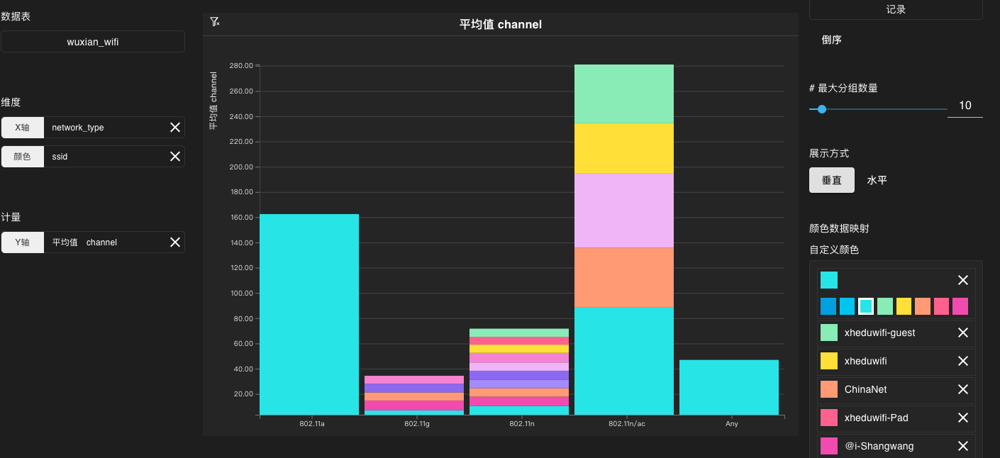
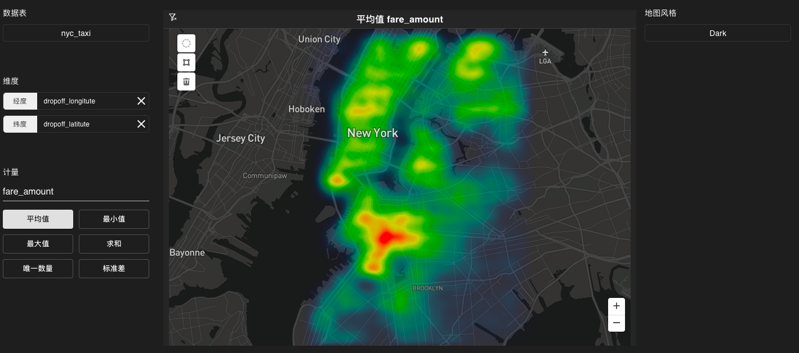

# 图表类型及参数设置

Infini 可视化交互分析界面支持多种图表类型。您可以对图表进行各种个性化设置。

<!-- TOC -->

- [数图](#数图)
- [折线图](#折线图)
- [饼图](#饼图)
- [条形图](#条形图)
- [堆垛图](#堆垛图)
- [表格](#表格)
- [热力图](#热力图)
- [气泡图](#气泡图)
- [点地图](#点地图)
- [热力地图](#热力地图)

<!-- /TOC -->

## 数图

| 参数 | 说明 |
|------|--------------|
|数据表  |   数据库中的表名。用于产生数图。   |
|维度    |   数图无需选择维度。   |
|计量    |   图表中计量用的列名和计量方式。包括以下参数：<ul><li>数值：数图中显示的数值。</li></ul>支持自定义使用 SQL 计量。关于支持的 SQL 函数请参考 [函数和操作符](https://www.zilliz.com/cn/docs/megawise_func_op)。              |
|计量数值格式 |  计量数据在图表中的显示格式。|
|颜色    |    数字颜色。            |

## 折线图

| 参数 | 说明 |
|------|--------------|
|数据表  |   数据库中的表名。用于产生折线图。   |
|维度    |   图表所需的维度。用于产生折线图的 X 轴数据。包括以下参数：<ul><li>X轴：作为折线图 X 轴数据的列。</li><li>颜色：折线的颜色。</li></ul> 支持使用表中的列名或自定义使用 SQL 分组。关于支持的 SQL 语法请参考 [基本数据操作](https://www.zilliz.com/cn/docs/megawise_basic_operation)。   |
|计量    |   图表中计量用的列名和计量方式。包括以下参数：<ul><li>Y轴1：作为折线图第一条折线 Y 轴数据的列。</li><li>Y轴：作为折线图第二条折线 Y 轴数据的列。</li></ul>  支持使用自带的计量函数或自定义使用 SQL 计量。关于支持的 SQL 函数请参考 [函数和操作符](https://www.zilliz.com/cn/docs/megawise_func_op)。           |
|图表样式 |   可选择折线图或区域图。        |
|计量数值格式 |  计量数据在图表中的显示格式。|
|分组维度格式 |  维度数据在图表中的显示格式。|
|自定义颜色    |    折线颜色。           |

## 饼图

| 参数 | 说明 |
|------|--------------|
|数据表  |   数据库中的表名。用于产生饼图。   |
|维度    |   图表所需的维度。支持使用表中的列名或自定义使用 SQL 分组。关于支持的 SQL 语法请参考 [基本数据操作](https://www.zilliz.com/cn/docs/megawise_basic_operation)。    |
|计量    |   图表中计量用的列名和计量方式。包括以下参数：<ul><li>大小：用于表示饼图中相关部分的大小。</li></ul>     支持使用自带的计量函数或自定义使用 SQL 计量。关于支持的 SQL 函数请参考 [函数和操作符](https://www.zilliz.com/cn/docs/megawise_func_op)。          |
|排序    |        数据库表的列名及顺序。作为图表的排序依据。  |  
|最大分组数量     |   饼图上能容纳的最大分组数量。    |
|颜色      |   饼图的配色方案。      |
|计量数值格式 |  计量数据在图表中的显示格式。|

## 条形图

| 参数 | 说明 |
|------|--------------|
|数据表  |   数据库中的表名。用于产生条形图。   |
|维度    |   图表所需的维度。支持使用表中的列名或自定义使用 SQL 分组。关于支持的 SQL 语法请参考 [基本数据操作](https://www.zilliz.com/cn/docs/megawise_basic_operation)。     |
|计量    |   图表中计量用的列名和计量方式。包括以下参数：<ul><li>数值：表示条形图中条形的长度。</li><li>颜色：表示条形图中条形的颜色。</li></ul>   支持使用自带的计量函数或自定义使用 SQL 计量。关于支持的 SQL 函数请参考 [函数和操作符](https://www.zilliz.com/cn/docs/megawise_func_op)。          |
|排序    |        数据库表的列名及顺序。作为图表的排序依据。  |  
|最大分组数量     |   条形图上能容纳的最大分组数量。    |
|颜色    |      条形图的配色方案。          |
|计量数值格式 |  计量数据在图表中的显示格式。|

## 堆垛图

| 参数 | 说明 |
|------|--------------|
|数据表  |   数据库中的表名。用于产生堆垛图。   |
|维度    |   图表所需的维度。包括以下参数：<ul><li>X轴：表示堆垛图中条形的分组。</li><li>颜色：表示堆垛图中条形的颜色。</li></ul> 支持使用表中的列名或自定义使用 SQL 分组。关于支持的 SQL 语法请参考 [基本数据操作](https://www.zilliz.com/cn/docs/megawise_basic_operation)。  |
|计量    |   图表中计量用的列名和计量方式。包括以下参数：<ul><li>Y轴：表示堆垛图中条形的长度。</li></ul>   支持使用自带的计量函数或自定义使用 SQL 计量。关于支持的 SQL 函数请参考 [函数和操作符](https://www.zilliz.com/cn/docs/megawise_func_op)。   |
|排序    |        数据库表的列名及顺序。作为图表的排序依据。  |  
|最大分组数量     |   堆垛图上能容纳的最大分组数量。    |
|展示方式 | 可选择垂直或水平。      |
|颜色数据映射    |      堆垛图中条形的配色方案。可以增加或删除列。        |

## 表格

| 参数 | 说明 |
|------|--------------|
|数据表  |   数据库中的表名。用于产生表格。   |
|维度    |   图表所需的维度。包括以下参数：<ul><li>列：用于产生表格中的数据列。支持设置多个列。</li></ul>   支持使用表中的列名或自定义使用 SQL 分组。关于支持的 SQL 语法请参考 [基本数据操作](https://www.zilliz.com/cn/docs/megawise_basic_operation)。 |
|计量    |   图表中计量用的列名和计量方式。包括以下参数：<ul><li>列：用于产生表格中对数据进行计量的列。支持设置多个列。</li></ul>   支持使用自带的计量函数或自定义使用 SQL 计量。关于支持的 SQL 函数请参考 [函数和操作符](https://www.zilliz.com/cn/docs/megawise_func_op)。   |
|计量数值格式 |  计量数据在图表中的显示格式。|
|分组维度格式 |  维度数据在图表中的显示格式。|

## 热力图

| 参数 | 说明 |
|------|--------------|
|数据表  |   数据库中的表名。用于产生热力图。   |
|维度    |   图表所需的维度。包括以下参数：<ul><li>X轴：表示热力图中 X 轴数据。</li><li>颜色：表示热力图中 Y 轴数据。</li></ul>  支持使用表中的列名或自定义使用 SQL 分组。关于支持的 SQL 语法请参考 [基本数据操作](https://www.zilliz.com/cn/docs/megawise_basic_operation)。  |
|计量    |   图表中计量用的列名和计量方式。包括以下参数：<ul><li>颜色：表示热力图中网格的颜色。</li></ul>支持使用自带的计量函数或自定义使用 SQL 计量。关于支持的 SQL 函数请参考 [函数和操作符](https://www.zilliz.com/cn/docs/megawise_func_op)。   |
|计量数值格式 |  计量数据在图表中的显示格式。|

## 气泡图

| 参数 | 说明 |
|------|--------------|
|数据表  |   数据库中的表名。用于产生气泡图。   |
|维度    |   图表所需的维度。支持使用表中的列名或自定义使用 SQL 分组。关于支持的 SQL 语法请参考 [基本数据操作](https://www.zilliz.com/cn/docs/megawise_basic_operation)。  |
|计量    |   图表中计量用的列名和计量方式。包括以下参数：<ul><li>X轴：表示气泡图中 X 轴数据。</li><li>Y轴：表示气泡图中 Y 轴数据。</li><li>颜色：表示气泡图中气泡的颜色。</li><li>大小：表示气泡图中气泡的大小。</li></ul>  支持使用自带的计量函数或自定义使用 SQL 计量。关于支持的 SQL 函数请参考 [函数和操作符](https://www.zilliz.com/cn/docs/megawise_func_op)。 |
|颜色    |     气泡图的颜色范围。          |
|计量数值格式 |  计量数据在图表中的显示格式。|

## 点地图

| 参数 | 说明 |
|------|--------------|
|数据表  |   数据库中的表名。用于产生点地图。   |
|维度    |   点地图无需选择维度。   |
|计量    |   图表中计量用的列名和计量方式。包括以下参数：<ul><li>经度：表示点的经度。</li><li>纬度：表示点的纬度。</li><li>颜色：表示点的颜色。</li></ul> 支持使用自带的计量函数或自定义使用 SQL 计量。关于支持的 SQL 函数请参考 [函数和操作符](https://www.zilliz.com/cn/docs/megawise_func_op)。          |
|地图风格  |  地图风格选项。             |
|点数量  |  地图中所有点的数量。           |
|点大小  |  地图中每个点的大小。             |
|弹出窗口内容 |  在地图上单击每个点时弹出的内容。             |
|颜色|     地图中所有点的配色方案。          |

## 热力地图

| 参数 | 说明 |
|------|--------------|
|数据表  |   数据库中的表名。用于产生热力地图。   |
|维度    |   图表所需的维度。包括以下参数：<ul><li>经度：表示数据的经度。</li><li>纬度：表示数据的纬度。</li></ul> 支持使用表中的列名或自定义使用 SQL 分组。关于支持的 SQL 语法请参考 [基本数据操作](https://www.zilliz.com/cn/docs/megawise_basic_operation)。  |
|计量    |   图表中计量用的列名和计量方式。包括以下参数：<ul><li>颜色：表示数据在地图上的颜色。支持使用自带的计量函数或自定义使用 SQL 计量。关于支持的 SQL 函数请参考 [函数和操作符](https://www.zilliz.com/cn/docs/megawise_func_op)。</li></ul>            |
|地图风格  |  地图风格选项。             |
